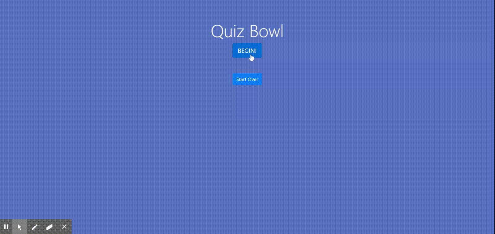

# Quiz Bowl

## <h2 id="link">Live Link</h2> https://jeverett93.github.io/quizbowl/

## <h2 id="description">Description</h2>
This an app that allows users to take a two-round quiz and see if their answers are correct after each question. At the end of each round, they can see their total score. They also have the option to start over at any time.



## Table of Contents
* <a href="#link">Live Link</a> 
* <a href="#description">Description</a>
* <a href="#tech">Technology Stack</a>
* <a href="#usage">Usage</a>
* <a href="#contributors">Contributors</a> 
* <a href="#contact">Contact</a>
    
## <h2 id="tech">Technology Stack</h2>
JavaScript, GIT, GitHub, HTML, CSS, Bootstrap

## <h2 id="usage">Usage</h2>

```
As a user, I want to be able to take a quiz and see my score at the end of each round.
```
    
## <h2 id="contributors">Contributors</h2>
[github.com/jeverett93](github.com/jeverett93)
    
## <h2 id="contact">Contact</h2>
* #### Name: Joshua Everett
* #### Portfolio: [jeverett.github.io](jeverett.github.io)
* #### Email: josheverett93@gmail.com
* #### LinkedIn: [https://www.linkedin.com/in/joshua-everett-087a4649/](https://www.linkedin.com/in/joshua-everett-087a4649/)

